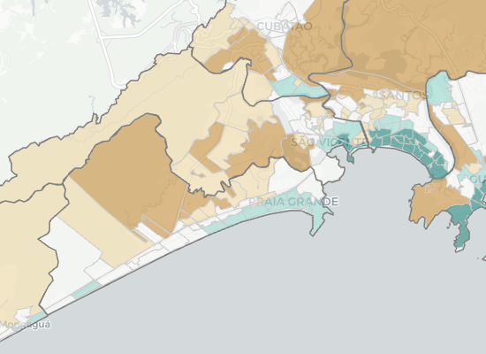
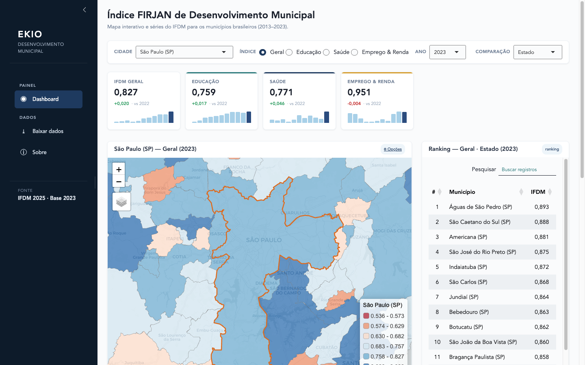

```{=html}
<style>
/* ── grid ── */
.app-grid {
  display: grid;
  grid-template-columns: repeat(2, minmax(0, 1fr));
  gap: 20px;
}
@media (max-width: 640px) {
  .app-grid { grid-template-columns: 1fr; }
}

/* ── card ── */
.app-card {
  display: flex;
  flex-direction: column;
  border: 1px solid #dde6ed;
  border-radius: 10px;
  background: #ffffff;
  overflow: hidden;
  transition: border-color 0.15s, box-shadow 0.15s;
}
.app-card:hover {
  border-color: #06436e;
  box-shadow: 0 2px 10px rgba(6,67,110,0.09);
}
.app-card[data-href] {
  cursor: pointer;
}

/* ── thumbnail ── */
.app-thumb {
  width: 100%;
  height: 170px;
  overflow: hidden;
  background: #f0f5f8;
  flex-shrink: 0;
}
.app-thumb img {
  width: 100%;
  height: 100%;
  object-fit: cover;
  object-position: top;
  display: block;
}
.app-thumb svg {
  width: 100%;
  height: 100%;
  display: block;
}

/* ── body ── */
.app-body {
  display: flex;
  flex-direction: column;
  gap: 8px;
  padding: 1rem 1.1rem 0.9rem;
  flex: 1;
}
.app-name {
  font-family: 'Gelasio', 'Playfair Display', serif;
  font-size: 1.05rem;
  font-weight: 600;
  color: #06436e;
  margin: 0;
  line-height: 1.3;
}
.app-desc {
  font-size: 0.87rem;
  color: #444;
  margin: 0;
  line-height: 1.55;
  flex: 1;
}
.app-footer {
  display: flex;
  align-items: center;
  justify-content: space-between;
  flex-wrap: wrap;
  gap: 6px;
  margin-top: 2px;
  padding-top: 8px;
  border-top: 1px solid #eef2f5;
}

/* ── badges ── */
.app-badges {
  display: flex;
  flex-wrap: wrap;
  gap: 5px;
  align-items: center;
}
.app-badge {
  font-size: 0.7rem;
  font-weight: 600;
  letter-spacing: 0.04em;
  text-transform: uppercase;
  padding: 2px 9px;
  border-radius: 20px;
}
.badge-urban      { background: #daeaf7; color: #0c4474; }
.badge-municipal  { background: #d5efe6; color: #0f5040; }
.badge-realestate { background: #ece9fd; color: #3c3489; }
.badge-mobility   { background: #fef0d6; color: #7a4d0a; }
.badge-stable     { background: #d4edda; color: #155724; }
.badge-dev        { background: #fff3cd; color: #7a4f00; }
.badge-shiny      { background: #6c757d; color: #ffffff; }

/* ── links ── */
.app-links {
  display: flex;
  gap: 10px;
  align-items: center;
}
.app-link {
  font-size: 0.78rem;
  color: #06436e;
  text-decoration: none;
  display: flex;
  align-items: center;
  gap: 4px;
  opacity: 0.75;
  transition: opacity 0.15s;
}
.app-link:hover { opacity: 1; text-decoration: underline; }
.app-link svg { width: 13px; height: 13px; flex-shrink: 0; }
.app-link-primary {
  font-size: 0.78rem;
  font-weight: 600;
  color: #06436e;
  text-decoration: none;
  display: flex;
  align-items: center;
  gap: 4px;
  opacity: 0.9;
  transition: opacity 0.15s;
}
.app-link-primary:hover { opacity: 1; text-decoration: underline; }
.app-link-primary svg { width: 13px; height: 13px; flex-shrink: 0; }
</style>

<p style="color:#555; font-size:0.95rem; max-width:56ch; margin-bottom:0.25rem;">
Interactive dashboards and data exploration tools built with R Shiny.
</p>

<div class="app-grid">

  <!-- Atlas Brasil -->
  <div class="app-card" data-cat="urban stable" data-href="https://restateinsight.com/posts/shiny-apps/atlas-brasil">
    <div class="app-thumb">
      
    </div>
    <div class="app-body">
      <p class="app-name">Atlas Brasil</p>
      <p class="app-desc">Interactive map of socioeconomic and demographic indicators across Brazil's metropolitan regions. Data from the Atlas of Human Development (PNUD, IPEA, FJP), covering Census 2000 and 2010 with income adjusted for inflation.</p>
      <div class="app-footer">
        <div class="app-badges">
          <span class="app-badge badge-urban">Urban</span>
          <span class="app-badge badge-stable">Stable</span>
          <span class="app-badge badge-shiny">Shiny</span>
        </div>
        <div class="app-links">
          <a class="app-link-primary" href="https://viniciusoike.shinyapps.io/shiny-atlas-brasil/" target="_blank">
            <svg xmlns="http://www.w3.org/2000/svg" viewBox="0 0 24 24" fill="none" stroke="currentColor" stroke-width="2" stroke-linecap="round" stroke-linejoin="round"><path d="M18 13v6a2 2 0 0 1-2 2H5a2 2 0 0 1-2-2V8a2 2 0 0 1 2-2h6"/><polyline points="15 3 21 3 21 9"/><line x1="10" y1="14" x2="21" y2="3"/></svg>
            Open app
          </a>
          <a class="app-link" href="https://github.com/viniciusoike/shiny-atlas-brasil" target="_blank">
            <svg xmlns="http://www.w3.org/2000/svg" viewBox="0 0 24 24" fill="currentColor"><path d="M12 .3a12 12 0 0 0-3.8 23.4c.6.1.8-.3.8-.6v-2c-3.3.7-4-1.6-4-1.6-.6-1.4-1.4-1.8-1.4-1.8-1-.7.1-.7.1-.7 1.2.1 1.8 1.2 1.8 1.2 1 1.8 2.8 1.3 3.5 1 .1-.8.4-1.3.7-1.6-2.7-.3-5.5-1.3-5.5-5.9 0-1.3.5-2.4 1.2-3.2 0-.4-.5-1.6.2-3.2 0 0 1-.3 3.3 1.2a11.5 11.5 0 0 1 6 0c2.3-1.5 3.3-1.2 3.3-1.2.7 1.6.2 2.8.1 3.2.8.8 1.2 1.9 1.2 3.2 0 4.6-2.8 5.6-5.5 5.9.4.4.8 1.1.8 2.2v3.3c0 .3.2.7.8.6A12 12 0 0 0 12 .3"/></svg>
            GitHub
          </a>
        </div>
      </div>
    </div>
  </div>

  <!-- IDH municípios -->
  <div class="app-card" data-cat="urban stable" data-href="https://restateinsight.com/posts/shiny-apps/ifdm">
    <div class="app-thumb">
      
    </div>
    <div class="app-body">
      <p class="app-name">IDH dos municípios</p>
      <p class="app-desc">Dashboard for exploring the Firjan Municipal Development Index (IFDM) across Brazilian municipalities. The IFDM follows a methodology similar to the UN's HDI but is calculated annually, covering employment, education, and health dimensions.</p>
      <div class="app-footer">
        <div class="app-badges">
          <span class="app-badge badge-municipal">Municipal</span>
          <span class="app-badge badge-stable">Stable</span>
          <span class="app-badge badge-shiny">Shiny</span>
        </div>
        <div class="app-links">
          <a class="app-link-primary" href="https://viniciusoike.shinyapps.io/shiny-firjan-ifdm/" target="_blank">
            <svg xmlns="http://www.w3.org/2000/svg" viewBox="0 0 24 24" fill="none" stroke="currentColor" stroke-width="2" stroke-linecap="round" stroke-linejoin="round"><path d="M18 13v6a2 2 0 0 1-2 2H5a2 2 0 0 1-2-2V8a2 2 0 0 1 2-2h6"/><polyline points="15 3 21 3 21 9"/><line x1="10" y1="14" x2="21" y2="3"/></svg>
            Open app
          </a>
          <a class="app-link" href="https://github.com/viniciusoike/shiny-firjan-ifdm" target="_blank">
            <svg xmlns="http://www.w3.org/2000/svg" viewBox="0 0 24 24" fill="currentColor"><path d="M12 .3a12 12 0 0 0-3.8 23.4c.6.1.8-.3.8-.6v-2c-3.3.7-4-1.6-4-1.6-.6-1.4-1.4-1.8-1.4-1.8-1-.7.1-.7.1-.7 1.2.1 1.8 1.2 1.8 1.2 1 1.8 2.8 1.3 3.5 1 .1-.8.4-1.3.7-1.6-2.7-.3-5.5-1.3-5.5-5.9 0-1.3.5-2.4 1.2-3.2 0-.4-.5-1.6.2-3.2 0 0 1-.3 3.3 1.2a11.5 11.5 0 0 1 6 0c2.3-1.5 3.3-1.2 3.3-1.2.7 1.6.2 2.8.1 3.2.8.8 1.2 1.9 1.2 3.2 0 4.6-2.8 5.6-5.5 5.9.4.4.8 1.1.8 2.2v3.3c0 .3.2.7.8.6A12 12 0 0 0 12 .3"/></svg>
            GitHub
          </a>
        </div>
      </div>
    </div>
  </div>

  <!-- Painel do Mercado Imobiliário -->
  <div class="app-card" data-cat="realestate dev">
    <div class="app-thumb">
      <svg viewBox="0 0 400 170" xmlns="http://www.w3.org/2000/svg">
        <rect width="400" height="170" fill="#eef4f8"/>
        <!-- top bar -->
        <rect x="0" y="0" width="400" height="32" fill="#06436e"/>
        <rect x="12" y="10" width="60" height="12" rx="3" fill="rgba(255,255,255,0.3)"/>
        <rect x="82" y="10" width="40" height="12" rx="3" fill="rgba(255,255,255,0.15)"/>
        <rect x="132" y="10" width="40" height="12" rx="3" fill="rgba(255,255,255,0.15)"/>
        <!-- sidebar -->
        <rect x="0" y="32" width="80" height="138" fill="#e2edf5"/>
        <rect x="10" y="44" width="60" height="8" rx="2" fill="#b0c8da"/>
        <rect x="10" y="60" width="50" height="8" rx="2" fill="#b0c8da"/>
        <rect x="10" y="76" width="55" height="8" rx="2" fill="#b0c8da"/>
        <rect x="10" y="92" width="45" height="8" rx="2" fill="#b0c8da"/>
        <!-- metric cards -->
        <rect x="92" y="40" width="72" height="44" rx="4" fill="#fff" stroke="#d0dfe8" stroke-width="0.5"/>
        <rect x="96" y="46" width="30" height="5" rx="1" fill="#c8d8e4"/>
        <rect x="96" y="57" width="44" height="10" rx="2" fill="#06436e" opacity="0.7"/>
        <rect x="172" y="40" width="72" height="44" rx="4" fill="#fff" stroke="#d0dfe8" stroke-width="0.5"/>
        <rect x="176" y="46" width="30" height="5" rx="1" fill="#c8d8e4"/>
        <rect x="176" y="57" width="44" height="10" rx="2" fill="#06436e" opacity="0.7"/>
        <rect x="252" y="40" width="72" height="44" rx="4" fill="#fff" stroke="#d0dfe8" stroke-width="0.5"/>
        <rect x="256" y="46" width="30" height="5" rx="1" fill="#c8d8e4"/>
        <rect x="256" y="57" width="44" height="10" rx="2" fill="#06436e" opacity="0.7"/>
        <rect x="332" y="40" width="56" height="44" rx="4" fill="#fff" stroke="#d0dfe8" stroke-width="0.5"/>
        <rect x="336" y="46" width="24" height="5" rx="1" fill="#c8d8e4"/>
        <rect x="336" y="57" width="36" height="10" rx="2" fill="#06436e" opacity="0.7"/>
        <!-- main chart area -->
        <rect x="92" y="92" width="216" height="68" rx="4" fill="#fff" stroke="#d0dfe8" stroke-width="0.5"/>
        <polyline points="100,148 120,135 142,138 165,118 188,122 210,108 232,112 252,100 272,104 292,95" fill="none" stroke="#06436e" stroke-width="1.8" stroke-linejoin="round" opacity="0.8"/>
        <!-- side chart -->
        <rect x="316" y="92" width="72" height="68" rx="4" fill="#fff" stroke="#d0dfe8" stroke-width="0.5"/>
        <rect x="324" y="130" width="8" height="20" rx="1" fill="#06436e" opacity="0.5"/>
        <rect x="336" y="118" width="8" height="32" rx="1" fill="#06436e" opacity="0.7"/>
        <rect x="348" y="124" width="8" height="26" rx="1" fill="#06436e" opacity="0.6"/>
        <rect x="360" y="110" width="8" height="40" rx="1" fill="#06436e" opacity="0.8"/>
        <rect x="372" y="120" width="8" height="30" rx="1" fill="#06436e" opacity="0.55"/>
      </svg>
    </div>
    <div class="app-body">
      <p class="app-name">Painel do Mercado Imobiliário</p>
      <p class="app-desc">Dashboard for monitoring the Brazilian real estate market. Tracks property price indices, credit flows, and housing indicators from multiple official sources, built on top of the <code>realestatebr</code> package.</p>
      <div class="app-footer">
        <div class="app-badges">
          <span class="app-badge badge-realestate">Real estate</span>
          <span class="app-badge badge-dev">Developing</span>
          <span class="app-badge badge-shiny">Shiny</span>
        </div>
        <div class="app-links">
          <a class="app-link" href="https://github.com/viniciusoike/shiny-painel-mercado" target="_blank">
            <svg xmlns="http://www.w3.org/2000/svg" viewBox="0 0 24 24" fill="currentColor"><path d="M12 .3a12 12 0 0 0-3.8 23.4c.6.1.8-.3.8-.6v-2c-3.3.7-4-1.6-4-1.6-.6-1.4-1.4-1.8-1.4-1.8-1-.7.1-.7.1-.7 1.2.1 1.8 1.2 1.8 1.2 1 1.8 2.8 1.3 3.5 1 .1-.8.4-1.3.7-1.6-2.7-.3-5.5-1.3-5.5-5.9 0-1.3.5-2.4 1.2-3.2 0-.4-.5-1.6.2-3.2 0 0 1-.3 3.3 1.2a11.5 11.5 0 0 1 6 0c2.3-1.5 3.3-1.2 3.3-1.2.7 1.6.2 2.8.1 3.2.8.8 1.2 1.9 1.2 3.2 0 4.6-2.8 5.6-5.5 5.9.4.4.8 1.1.8 2.2v3.3c0 .3.2.7.8.6A12 12 0 0 0 12 .3"/></svg>
            GitHub
          </a>
        </div>
      </div>
    </div>
  </div>

  <!-- SPOD Dashboard -->
  <div class="app-card" data-cat="mobility dev">
    <div class="app-thumb">
      <svg viewBox="0 0 400 170" xmlns="http://www.w3.org/2000/svg">
        <rect width="400" height="170" fill="#eef4f8"/>
        <!-- top bar -->
        <rect x="0" y="0" width="400" height="32" fill="#185fa5"/>
        <rect x="12" y="10" width="70" height="12" rx="3" fill="rgba(255,255,255,0.3)"/>
        <rect x="92" y="10" width="44" height="12" rx="3" fill="rgba(255,255,255,0.15)"/>
        <rect x="146" y="10" width="44" height="12" rx="3" fill="rgba(255,255,255,0.15)"/>
        <!-- map area (left) -->
        <rect x="8" y="40" width="210" height="122" rx="4" fill="#dce8f0" stroke="#c8d8e4" stroke-width="0.5"/>
        <!-- map roads sketch -->
        <line x1="8" y1="100" x2="218" y2="100" stroke="#fff" stroke-width="1.5" opacity="0.6"/>
        <line x1="100" y1="40" x2="100" y2="162" stroke="#fff" stroke-width="1.5" opacity="0.6"/>
        <line x1="8" y1="70" x2="218" y2="130" stroke="#fff" stroke-width="1" opacity="0.4"/>
        <!-- origin-destination dots -->
        <circle cx="60" cy="75" r="5" fill="#185fa5" opacity="0.85"/>
        <circle cx="140" cy="95" r="5" fill="#185fa5" opacity="0.85"/>
        <circle cx="80" cy="130" r="4" fill="#185fa5" opacity="0.7"/>
        <circle cx="170" cy="60" r="4" fill="#185fa5" opacity="0.7"/>
        <circle cx="115" cy="148" r="3.5" fill="#185fa5" opacity="0.6"/>
        <!-- flow lines -->
        <line x1="60" y1="75" x2="140" y2="95" stroke="#185fa5" stroke-width="2" opacity="0.5"/>
        <line x1="60" y1="75" x2="170" y2="60" stroke="#185fa5" stroke-width="1.5" opacity="0.4"/>
        <line x1="80" y1="130" x2="140" y2="95" stroke="#185fa5" stroke-width="1.5" opacity="0.4"/>
        <line x1="115" y1="148" x2="140" y2="95" stroke="#185fa5" stroke-width="1" opacity="0.35"/>
        <!-- right panel -->
        <rect x="226" y="40" width="166" height="54" rx="4" fill="#fff" stroke="#d0dfe8" stroke-width="0.5"/>
        <rect x="234" y="48" width="60" height="6" rx="1" fill="#c8d8e4"/>
        <rect x="234" y="60" width="48" height="12" rx="2" fill="#185fa5" opacity="0.7"/>
        <rect x="234" y="76" width="36" height="5" rx="1" fill="#d5e8f5"/>
        <rect x="226" y="102" width="166" height="60" rx="4" fill="#fff" stroke="#d0dfe8" stroke-width="0.5"/>
        <!-- mini bar chart -->
        <rect x="234" y="140" width="10" height="12" rx="1" fill="#185fa5" opacity="0.5"/>
        <rect x="248" y="130" width="10" height="22" rx="1" fill="#185fa5" opacity="0.7"/>
        <rect x="262" y="124" width="10" height="28" rx="1" fill="#185fa5" opacity="0.8"/>
        <rect x="276" y="132" width="10" height="20" rx="1" fill="#185fa5" opacity="0.6"/>
        <rect x="290" y="118" width="10" height="34" rx="1" fill="#185fa5" opacity="0.85"/>
        <rect x="304" y="126" width="10" height="26" rx="1" fill="#185fa5" opacity="0.65"/>
        <rect x="318" y="136" width="10" height="16" rx="1" fill="#185fa5" opacity="0.5"/>
        <rect x="332" y="122" width="10" height="30" rx="1" fill="#185fa5" opacity="0.75"/>
        <rect x="346" y="134" width="10" height="18" rx="1" fill="#185fa5" opacity="0.55"/>
        <rect x="360" y="128" width="10" height="24" rx="1" fill="#185fa5" opacity="0.7"/>
        <rect x="374" y="114" width="10" height="38" rx="1" fill="#185fa5" opacity="0.9"/>
      </svg>
    </div>
    <div class="app-body">
      <p class="app-name">SPOD Dashboard</p>
      <p class="app-desc">Interactive dashboard for the São Paulo Origin-Destination Survey (Pesquisa OD). Visualizes travel patterns, modal splits, and mobility flows across the metropolitan region, built on top of the <code>odsp</code> package.</p>
      <div class="app-footer">
        <div class="app-badges">
          <span class="app-badge badge-mobility">Mobility</span>
          <span class="app-badge badge-dev">Developing</span>
          <span class="app-badge badge-shiny">Shiny</span>
        </div>
        <div class="app-links">
          <a class="app-link" href="https://github.com/viniciusoike/shiny-pod-dashboard" target="_blank">
            <svg xmlns="http://www.w3.org/2000/svg" viewBox="0 0 24 24" fill="currentColor"><path d="M12 .3a12 12 0 0 0-3.8 23.4c.6.1.8-.3.8-.6v-2c-3.3.7-4-1.6-4-1.6-.6-1.4-1.4-1.8-1.4-1.8-1-.7.1-.7.1-.7 1.2.1 1.8 1.2 1.8 1.2 1 1.8 2.8 1.3 3.5 1 .1-.8.4-1.3.7-1.6-2.7-.3-5.5-1.3-5.5-5.9 0-1.3.5-2.4 1.2-3.2 0-.4-.5-1.6.2-3.2 0 0 1-.3 3.3 1.2a11.5 11.5 0 0 1 6 0c2.3-1.5 3.3-1.2 3.3-1.2.7 1.6.2 2.8.1 3.2.8.8 1.2 1.9 1.2 3.2 0 4.6-2.8 5.6-5.5 5.9.4.4.8 1.1.8 2.2v3.3c0 .3.2.7.8.6A12 12 0 0 0 12 .3"/></svg>
            GitHub
          </a>
        </div>
      </div>
    </div>
  </div>

</div>

<script>
document.querySelectorAll('.app-card[data-href]').forEach(card => {
  card.addEventListener('click', function(e) {
    window.location.href = this.dataset.href;
  });
});
document.querySelectorAll('.app-card[data-href] a').forEach(link => {
  link.addEventListener('click', function(e) {
    e.stopPropagation();
  });
});
</script>
```
