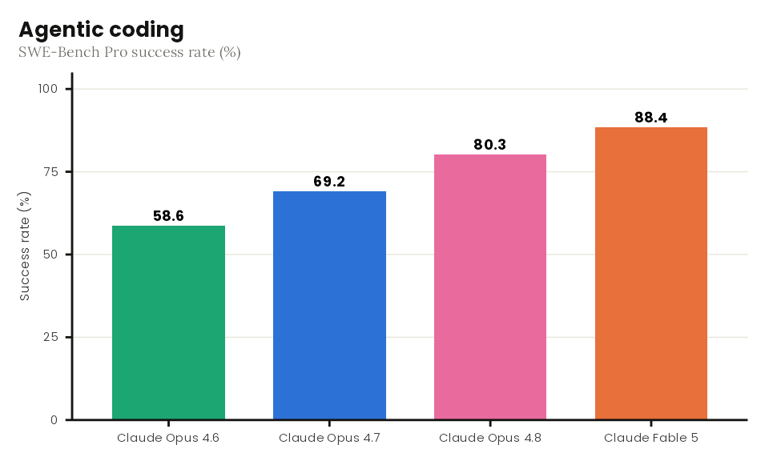
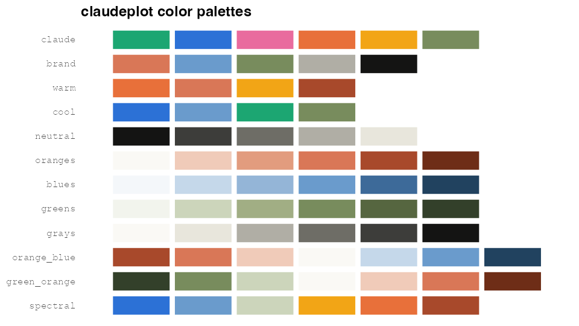

# A package born from a single prompt

On June 9, 2026, Anthropic released **Claude Fable 5**, the first model in
its new Mythos-class tier. Release days are good days for stress tests, so I
gave the new model one: build a complete, real R package, end to end, from
essentially a single prompt.

The result is [**claudeplot**](https://github.com/viniciusoike/claudeplot),
a `ggplot2` extension that brings the visual language of Anthropic and
Claude to R — and that was, fittingly, written almost entirely by Claude
itself.

{fig-alt="Bar chart styled with theme_claude showing SWE-Bench Pro scores for recent Claude models."}

# What claudeplot does

The package is a fairly classic "theme + scales" `ggplot2` extension:

- `theme_claude()`, a clean, publication-ready theme;
- discrete and continuous color/fill scales (`scale_color_claude_d()`,
  `scale_fill_claude_c()`, and friends);
- twelve palettes drawn from Anthropic's brand and data-visualization
  style, organized in qualitative (`claude`, `brand`, `warm`, `cool`,
  `neutral`), sequential (`oranges`, `blues`, `greens`, `grays`), and
  diverging (`orange_blue`, `green_orange`, `spectral`) families;
- palette display helpers, `show_claude_palette()` and
  `show_claude_palettes()`;
- Anthropic's recommended open typefaces — **Poppins** for headings and
  **Lora** for body text — bundled under the SIL Open Font License and
  registered automatically via `systemfonts`.

A minimal example:

```{r}
library(ggplot2)
library(claudeplot)

df <- data.frame(
  model = c("Claude Opus 4.6", "Claude Opus 4.7", "Claude Opus 4.8", "Claude Fable 5"),
  score = c(58.6, 69.2, 80.3, 88.4)
)

ggplot(df, aes(model, score, fill = model)) +
  geom_col(width = 0.7) +
  scale_fill_claude_d() +
  labs(
    title = "Agentic coding",
    subtitle = "SWE-Bench Pro success rate (%)",
    x = NULL, y = "Success rate (%)"
  ) +
  theme_claude() +
  theme(legend.position = "none")
```

And the full palette catalog:

```{r}
show_claude_palettes()
```

{fig-alt="Grid showing all twelve claudeplot palettes: qualitative, sequential, and diverging families."}

# How it was actually made

I have built a few `ggplot2` theme packages by hand before, so I know how
much invisible work hides in a "simple" package like this: palette
interpolation that behaves well at any `n`, scales that respect both
`color` and `colour`, font registration that degrades gracefully when
`systemfonts` or `ragg` are missing, font licensing, tests, documentation,
a vignette, a pkgdown site.

This time, the workflow was different. I wrote one long prompt describing
what I wanted — an Anthropic/Claude-inspired theme package, built to CRAN
standards — and pointed Claude at a few useful references: Anthropic's
published [brand guidelines](https://github.com/anthropics/skills/blob/main/skills/brand-guidelines/SKILL.md)
and some of my earlier theme packages as structural templates.

From there, Claude handled the rest end to end:

- researching the brand colors and chart style and turning them into
  coherent qualitative, sequential, and diverging palettes;
- writing the theme, palettes, scales, and display helpers;
- bundling Poppins and Lora (checking that the SIL OFL allows
  redistribution) and wiring up automatic registration with a
  `claude_font_status()` diagnostic;
- writing unit tests with `testthat` and visual regression tests with
  `vdiffr`;
- writing the documentation, README, and vignette;
- getting the package to pass `R CMD check --as-cran` with **zero errors,
  warnings, or notes**;
- shipping the GitHub repository and the
  [pkgdown site](https://viniciusoike.github.io/claudeplot/), hex logo
  included.

The honest caveat, which is also in the README: this is a demonstration,
not a battle-tested library. The package is marked experimental, and it
earned that badge in roughly the time it takes to drink a coffee.

# What I take away from this

Two things surprised me.

First, the *completeness*. The hard part of R package development was
never writing a `theme()` call — it is everything around it. The model
handled the boring-but-essential 80%: licensing checks for bundled fonts,
graceful fallbacks, `Suggests` vs `Imports` decisions, visual snapshot
tests, CRAN-style checks. That is exactly the part that usually makes
side-project packages die half-finished on a hard drive.

Second, the *leverage of good references*. The single prompt worked
because it pointed at concrete, high-quality material: official brand
guidelines and existing packages with a structure worth imitating. The
lesson generalizes — the model multiplies the quality of what you hand it.

If you want to try it:

```{r}
# install.packages("pak")
pak::pak("viniciusoike/claudeplot")
```

claudeplot is an unofficial community package and is not affiliated with
or endorsed by Anthropic. Issues and PRs are welcome on
[GitHub](https://github.com/viniciusoike/claudeplot/issues).
